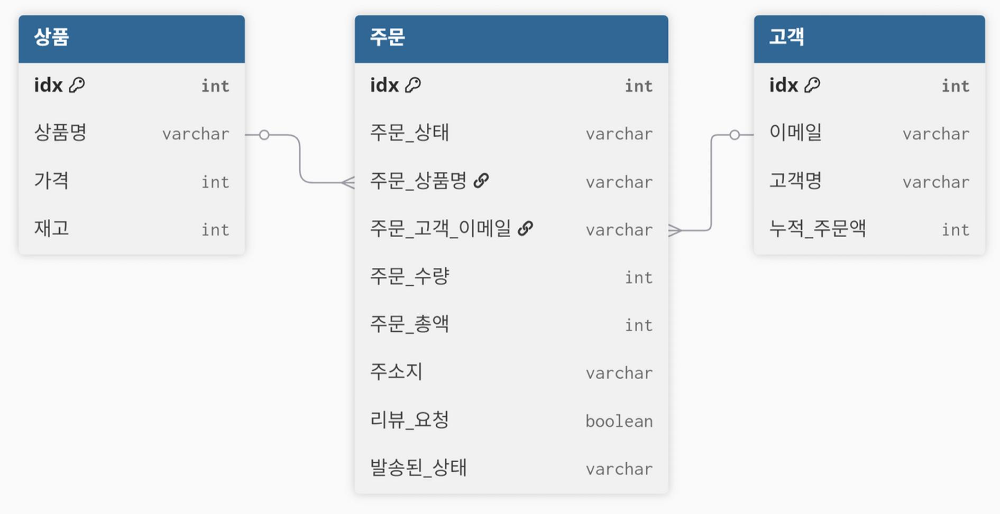

# 🛒 Baserow와 n8n을 활용한 쇼핑몰 운영 프로세스 자동화

> **"반복적인 매입·판매·영업 업무 부하를 기술로 해소하고, 모바일 환경에서 주문부터 알림까지 단절 없이 관리하는 자동화 솔루션"**

---

## 1. 프로젝트 배경 및 목적
* **문제 제기:** 1인 사업자가 겪는 주문 확인, 재고 파악, 송장 입력, CS 등 과중한 반복 업무의 병목 현상 발생
* **해결 방안:** n8n 워크플로우 엔진과 Baserow DB를 통합하여 사람의 개입 없이 작동하는 데이터 파이프라인 구축
* **핵심 목표:** 모바일 기기 하나만으로 주문 접수부터 고객 알림까지 원스톱으로 처리 가능한 실시간 가용성 확보

---

## 2. 시스템 아키텍처 및 기술 스택
이 프로젝트는 입력-로직-저장-출력의 4단계 데이터 파이프라인으로 구성되었습니다.

* **Input (입력):** Google Forms (주문서, 재고 입고, 환불 요청, 구매 후기)
* **Logic (워크플로우):** n8n (13개의 자동화 워크플로우 설계), Google Sheets (트리거용)
* **Database (DB):** Baserow (상품, 고객, 주문 테이블 연동)
* **Output (채널):** Gmail (고객 상태 알림, 관리자 매출 보고서 발송)

---

## 3. 핵심 자동화 워크플로우 (Core Workflows)

### 주문 및 재고 처리 (Order & Inventory)
* **주문 접수 및 고객 식별:** 주문 폼 수신 시 이메일을 검색하여 기존/신규 고객을 구분하고 누적 주문액을 자동 업데이트합니다.
* **실시간 재고 차감 로직:** 실시간 재고를 확인(Switch)하여 재고가 충분하면 즉시 차감하고, 부족 시 주문을 '보류' 상태로 변경합니다.
* **보류 주문 재처리:** 15분마다 시스템을 깨워 입고 등으로 재고가 확보된 보류 주문이 있는지 확인하여 자동 재처리합니다.

### 재무 관리 및 리포팅 (Finance & Logistics)
* **일일/월별 매출 보고서:** 매일 자정(전날 매출) 및 매월 1일(누적 매출) 보고서를 자동 생성하여 이메일로 발송합니다.
* **저재고 경고 알림:** 재고가 안전 수준(10개 이하) 미만인 상품을 감지하여 담당자에게 즉시 알림을 보냅니다.
* **자동 배송 명세서:** 매일 오전 9시, 배송 준비 상태인 주문 목록을 취합하여 관리자에게 보고합니다.

### 고객 커뮤니케이션 및 마케팅 (CS & Marketing)
* **고객 상태 자동 알림:** DB의 주문 상태 변경을 30초마다 감지하여 고객에게 맞춤형 이메일을 발송합니다.
* **리뷰 요청 자동화:** 배송 완료 상태인 고객에게 일정 주기로 리뷰 작성 요청 메일을 발송합니다.
* **VIP 타겟 마케팅:** 누적 주문액 100,000원 이상의 고객을 자동 필터링하여 매주 월요일 특별 카탈로그를 전송합니다.

---

## 🗄 4. 데이터베이스 설계 (ERD)
Baserow를 활용하여 정형화된 관계형 데이터베이스를 설계하였습니다.

* **상품 테이블:** 상품명, 가격, 재고
* **고객 테이블:** 이메일, 고객명, 누적 주문액
* **주문 테이블:** 주문 상태, 수량, 총액, 주소지, 리뷰 요청 여부 등

---

## 5. 팀원별 역할 (R&R)
| 팀원 | 담당 역할 | 핵심 성과 |
| :--- | :--- | :--- |
| **이예영** | 주문/재고 처리 & DB | 주문 접수, 주문 처리, 재고 처리, 배송 완료 처리, 보류 주문 재처리 |
| **서지연** | 재무 관리 | 배송 처리, 저재고 알림, 일/월별 재무 처리  |
| **오지현** | CS/커뮤니케이션 | 고객 상태 알림, 리뷰 요청  |
| **이가은** | 환불 & 마케팅 & CS | 환불 처리,  VIP 타겟 마케팅, 고객 주문 상태 알림 |

---

## 5. 프로젝트 결과 및 기대효과
* **업무 효율성:** 사람이 직접 수행하던 13개 영역의 반복 업무를 완전 자동화하여 운영 리소스 대폭 절감
* **정확도 향상:** 수기 관리에서 발생할 수 있는 휴먼 에러를 차단하고 실시간 데이터 동기화 실현
